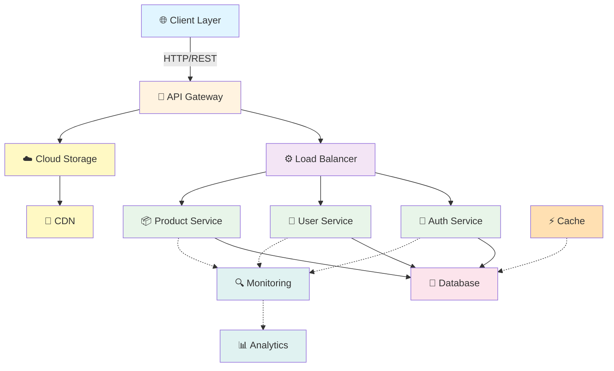

# API Architecture Overview - Cloud Infrastructure

## Architecture Diagram

## Components

### Client Layer
- Web Applications
- Mobile Applications
- Desktop Applications

### API Gateway
- Request routing
- Rate limiting
- Authentication middleware

### Load Balancer
- Distributes traffic
- Health checks
- Auto-scaling

### Microservices
- **Auth Service**: User authentication and authorization
- **User Service**: User management and profiles
- **Product Service**: Product catalog and management

### Data Layer
- **Database**: Primary data storage (PostgreSQL/MySQL)
- **Cache**: Redis for performance optimization

### Cloud Infrastructure
- **Cloud Storage**: S3 or equivalent for file storage
- **CDN**: Content Delivery Network for asset distribution

### Monitoring & Logging
- Analytics dashboard
- Real-time monitoring
- Performance metrics